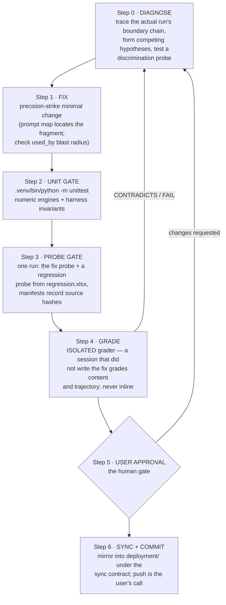
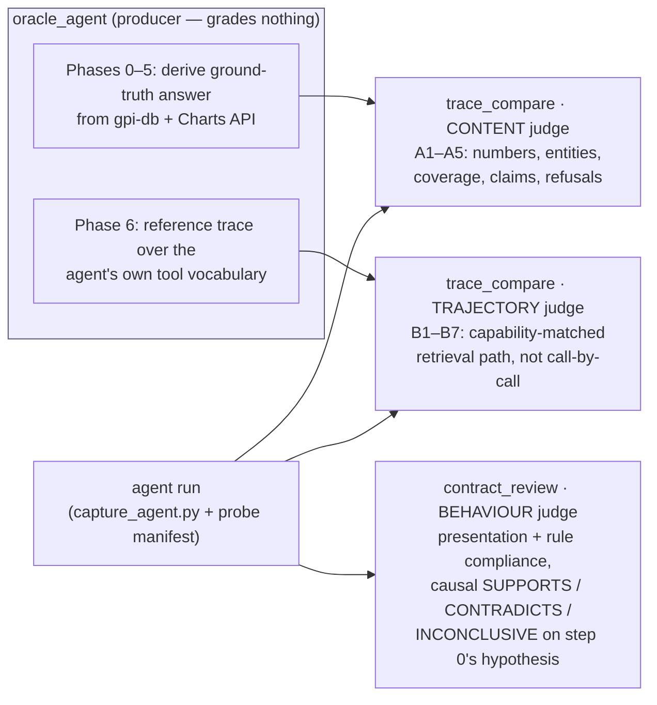

# flavorwiki_react_agent_workflow

A LangGraph **ReAct agent that answers natural-language questions about FlavorWiki survey
data**, plus the engineering workflow this repo exists to document: how the agent is built,
how it is patched when it goes wrong, and how every patch is graded before release.

Three layers, three entry points:

| Layer | What it is | Where |
|---|---|---|
| **The agent** | A guarded ReAct loop over a read-only PostgreSQL survey database and a Charts statistics API | [`funda_agent_exp.py`](funda_agent_exp.py), [`docs/agent_exp_doc.md`](docs/agent_exp_doc.md) |
| **The patch workflow** | A gated, evidence-driven procedure (steps 0–6) for diagnosing and fixing agent defects | [`PROTOCOL.md`](PROTOCOL.md) |
| **The evaluation skills** | Claude Code procedures that derive ground truth and grade every fix independently | [`skills/`](skills/) |

The core principle, in one sentence: **the model decides what a question means and which
evidence to retrieve; deterministic Python controls scope, SQL safety, tool execution,
grading and termination.**

---

## 1. What the agent can do

- Answer survey questions through **read-only PostgreSQL queries** (guarded `SELECT`/`WITH` only).
- Serve from a **precomputed inventory** — products, scored measures, per-product means/SDs —
  attached to the first turn so most questions need no SQL at all.
- Retrieve the same packet for an **authorized historical or benchmark survey**.
- Call the **Charts API** for ANOVA, Tukey, Pearson, Spearman and chi-square results.
- Run **PLSR** (driver analysis: which measures drive which attribute) and **respondent
  clustering** over attribute-rating profiles.
- Produce **evidence-grounded personas** from categorical responses.
- Emit **trusted chart artifacts** (word clouds, PCA scatter) that never pass through
  model-authored text — the harness splices them in at final assembly.
- Keep **short-term conversation memory** via a checkpointed graph and repeated `thread_id`.

---

## 2. Architecture

### 2.1 Modules

```
┌─────────────────────┐   ┌─────────────────────┐
│ agent_instructions.py│   │   tool_prompts.py    │   every model-facing string lives here:
│  system prompt, rule │   │ tool descriptions,   │   behavioural rules in the left module,
│  blocks, scope pre-  │   │ feedback & rejection │   "what a tool is for" in the right one
│  ambles, notices     │   │ text                 │
└──────────┬──────────┘   └──────────┬──────────┘
           │  imported as constants  │
           ▼                         ▼
┌─────────────────────────────────────────────────┐
│               funda_agent_exp.py                │  LangGraph graph, AgentState, tools,
│  (the agent runtime)                            │  inventory + cache, DB access, scope/
└──────────────────────┬──────────────────────────┘  authorization, history trimming, CLI
                       │ same graph, same tools
                       ▼
┌─────────────────────────────────────────────────┐
│            api_funda_agent_exp.py               │  FastAPI / NDJSON streaming wrapper,
│  (HTTP entry point for the container)           │  API scope resolution, checkpoints
└─────────────────────────────────────────────────┘
```

`funda_agent_exp.py` also carries the numeric engines' callers; the engines themselves
([`plsr.py`](plsr.py), [`clustering.py`](clustering.py)) are dependency-free (numpy only) so
tests can drive them without an LLM or a database.

### 2.2 Graph topology

Two nodes, one conditional edge. `MAX_LLM_STEPS = 12` counts **LLM invocations**.

```
                     tool calls present
      ┌────────────┐ ───────────────────► ┌────────────┐
START │    LLM     │                      │   tools    │
 ───► │ call_model │ ◄─────────────────── │ call_tool  │
      └──────┬─────┘      unconditional   └────────────┘
             │
             │ no tool calls, or step budget exhausted
             ▼
            END
```

On the twelfth (final) permitted turn, tools are deliberately **unbound** and a step-budget
notice forces the model to synthesize from evidence already collected and disclose what is
still unresolved. Always read the halt reason off a transcript: answered, budget-exhausted,
or refused.

### 2.3 Turn lifecycle and the guardrail chain

```
user question (scope ids injected into the USER message, never the system prompt)
   │  inventory packet pre-fetched and appended (unless --no-inventory)
   ▼
call_model ──► plain answer ──────────────────────────────────────────► END
   │
   │ tool call(s)
   ▼
nl2sql_tool guardrails, in order:
   scope-ID repair (≤ N edits, disclosed) → single-statement check → SELECT/WITH only
   → semantic-filter rejection (no LIKE on prompt/label columns) → scope-parameter binding
   → read-only transaction + 20 s statement timeout → JSON rows back to the model
   ▼
call_tool: one ToolMessage per call, zero-row streak tracking, repeated-query
   fingerprinting, <progress_gathered> index persisted with the next AI message
   ▼
back to call_model …
```

Parallelism: the model may emit several tool calls in one response; `call_tool` executes a
**homogeneous batch** of `nl2sql_tool` (or `run_survey_stats`) calls concurrently on a thread
pool, consuming results in call order for a stable history. Mixed batches run sequentially.

Memory is three independent mechanisms — do not confuse them: the **checkpoint**
(`InMemorySaver`, per `thread_id`), **history trimming** (`_trim_history`, oldest complete
rounds dropped), and **progress memory** (the model's own `<progress_gathered>` index into
prior tool results — an index, never a substitute).

### 2.4 Tools

`build_tools()` is the **authoritative** list — a tool named in a prompt but absent from it is
a dead promise. Six tools are currently bound:

| Tool | What it does |
|---|---|
| `nl2sql_tool` | One guarded, read-only SQL statement per call; JSON array result |
| `get_survey_analysis_packet` | Inventory packet for an authorized survey (current / same-org / fixed benchmark), tenancy checked server-side |
| `run_survey_stats` | Charts API: ANOVA, Tukey, Pearson, Spearman, chi-square; provenance notice for non-current surveys |
| `analyze_plsr` | PLS1 driver analysis (NIPALS, VIP scores) over question-level measures |
| `cluster_rating_profiles` | k-means over respondent attribute-rating profiles |
| `generate_word_cloud` | Deterministic term counts from an open-ended question; the chart payload is parked in state and spliced into the final answer, never through the model |

(An older section of [`docs/agent_exp_doc.md`](docs/agent_exp_doc.md) still says "five tools";
the code wins — check `build_tools()` before trusting any doc on this point.)

### 2.5 Prompts and the prompt map

The system prompt is a **pure function of config** — byte-identical across surveys, so it stays
a stable prompt-cache prefix. Per-run ids arrive in the user message instead.

Every model-facing fragment is inventoried in
[`docs/generated/agent-prompt-map.md`](docs/generated/agent-prompt-map.md) /
[`.json`](docs/generated/agent-prompt-map.json): source symbol, line range, delivery path,
inclusion condition. Prompt edits are located through the map, never by eyeballing paragraphs.

---

## 3. Patching the agent when it gets problems — `PROTOCOL.md`

Every change to the agent follows one gated workflow. Nothing skips a gate.



Key disciplines the diagram encodes:

- **Step 0 is a boundary chain, not a guess.** You localize the failure along the actual
  information path before touching anything, and a hypothesis is only accepted if a probe
  *discriminates* it from the competitors (see 3.1).
- **Step 1 is minimal.** The prompt map identifies the exact record; `used_by` /
  `composed_from` reveal every other consumer of the same fragment before its meaning changes.
- **Step 4 can never be the fixing session.** Grading in the context that wrote the fix is
  narration, not evidence.
- **Step 6 never happens before Step 5.** Nothing is written into `deployment/` until the user
  has run and approved the change.

### 3.1 The boundary chain — where a wrong value actually came from

```
prompt rule present?          ← agent_instructions.py / tool_prompts.py (check the map)
   ▼
model decision                ← which tool, which SQL, which question id
   ▼
tool + arguments              ← pydantic schema, UUIDs
   ▼
inside the tool               ← guardrail rejection? scope repair? authorization?
   │                            DB rows? Charts API? normalization/rounding?
   ▼
output ownership              ← model-authored text, or trusted artifact spliced by harness?
   ▼
state / memory                ← stale scratch fields? trimming? progress index?
   ▼
final response → sanitizer / assembly → transport (CLI vs API streaming)

axis, parallel to every stage: halt reason — answered · budget-exhausted · refused
```

Each region has exactly one owning component. "The answer was wrong" is not a diagnosis;
"the second SQL call bound the wrong question id because the inventory listed a pooled
attribute" is. **The first thing on the chain that can explain the observation is where the
fix belongs** — and prompt rules are only one link. A matching rule, a shared workflow or a
present instruction proves relevance, not causation; the discrimination probe establishes the
causal claim or you record the hypothesis as unproven.

### 3.2 The grading system — `skills/` (Claude Code workflow)

Three independent judge procedures plus a prompt-map builder. The architecture is a strict
separation between **producing** ground truth and **judging** the agent against it:



| Skill | Role | What it may and may not do |
|---|---|---|
| [`oracle_agent`](skills/oracle_agent/SKILL.md) | Producer | Derives the ground-truth answer and the reference trajectory; **judges nothing** |
| [`trace_compare`](skills/trace_compare/SKILL.md) | Judge | Scores **content** against the ground truth and **trajectory** against the reference, in two separate blocks; **never re-derives** evidence |
| [`contract_review`](skills/contract_review/SKILL.md) | Judge | Grades presentation/behaviour only, plus causal localization of the failure; **never grades content numbers** |
| [`agent-prompt-mapper`](skills/agent-prompt-mapper/SKILL.md) | Tooling | Rebuilds the prompt map after any model-facing edit |

Invariants that make the evidence trustworthy:

- The **producer never judges; the judges never derive; the fixing session never grades.**
- Trajectories are compared by **capability, not call count** — the oracle's `query.sh` and
  the agent's `nl2sql_tool` are the same *act*; extra agent steps are only defects if they
  change content or repeat a failed retrieval.
- **One run is the budget** for a graded probe; each oracle script auto-logs its retrieval
  step when `ORACLE_TRACE_FILE` is set, so the trajectory is machine truth, not narration.
- **Truncated ≠ absent** in transcripts (500/1000-char limits): a grader must record a
  limitation rather than grade against unseen content.

### 3.3 Evidence bookkeeping

Every case leaves a paper trail, so a "fixed" claim is always checkable:

- `regression.xlsx` — probes that ever caught a defect are **promoted** into a Suite/Case row.
- `probe_scratchpad.md` — the case record: hypothesis, probes, manifests (source hashes bind
  each run to an exact revision), grader verdicts, and any **accepted exceptions**.
- Generated prompt-map records keep instruction edits traceable to symbols and line ranges.

### 3.4 The sync contract (working tree → `deployment/`)

`deployment/` is the deployable copy of the same agent with deliberately **different
configuration handling**. Agent behaviour must stay identical; configuration must stay
divergent.

```
┌────────────────────────┬────────────────────────────────────────────────────┐
│ category               │ rule                                               │
├────────────────────────┼────────────────────────────────────────────────────┤
│ core agent code        │ always-sync; must remain byte-identical between    │
│ (5 model-facing files) │ the trees — verified by hash, not by memory        │
├────────────────────────┼────────────────────────────────────────────────────┤
│ config-band files      │ NEVER `cp`. Apply the same edit as an anchored     │
│ (env/secret handling    │ patch (assert the old text occurs exactly once);   │
│  differs by design)    │ the trees' configuration blocks stay divergent     │
├────────────────────────┼────────────────────────────────────────────────────┤
│ local-only             │ tests/, scripts/, skills/, docs/ (incl. the prompt │
│                        │ map), PROTOCOL.md, regression.xlsx, probes,        │
│                        │ docker-compose — none of it belongs in deployment/ │
├────────────────────────┼────────────────────────────────────────────────────┤
│ never                  │ any .env, DB URI, credential or hardcoded key in   │
│                        │ deployment/ — environment variables only           │
└────────────────────────┴────────────────────────────────────────────────────┘
```

And the order is fixed: **change in the working tree → the user runs it and approves → only
then sync to `deployment/` → push is the user's call.**

---

## 4. Quick start

```bash
# 1. Local database (Docker container, port 5433)
docker start gpi-db            # or: docker compose up -d

# 2. Environment (numpy is the ONLY numeric dependency — no pandas/sklearn/scipy)
python -m venv .venv && . .venv/bin/activate
pip install -r requirements.txt
# .env: OPENAI_API_KEY, DATABASE_URL, CHARTS_API_BASE_URL + secret header
#       (read from the environment — nothing is hardcoded anymore)

# 3. Ask one scoped question
.venv/bin/python funda_agent_exp.py \
  --survey-id 6263cf71-23b7-4462-9ccf-4a00a7267672 \
  --prompt "Sort the products by overall liking."

# 4. Multi-turn memory on one thread
.venv/bin/python funda_agent_exp.py --chat --thread-id session-1 \
  --survey-id 6263cf71-23b7-4462-9ccf-4a00a7267672

# 5. HTTP server
uvicorn api_funda_agent_exp:app --host 0.0.0.0 --port 8000

# 6. Offline tests (no LLM, no DB — the fast gate of step 2)
.venv/bin/python -m unittest tests.test_plsr tests.test_clustering -q
```

Note `docs/API_CONTRACT.md` for the streaming NDJSON event contract, and that only `prompt`
and `survey_id` are required over HTTP — client/org are derived server-side from the survey.

---

## 5. Repository layout

```
funda_agent_exp.py            the agent: graph, state, tools, scope, DB, CLI
api_funda_agent_exp.py        FastAPI / NDJSON streaming entry point
agent_instructions.py         system prompt + every behavioural rule block
tool_prompts.py               tool descriptions + tool-returned feedback text
plsr.py · clustering.py       dependency-free numeric engines (numpy only)

PROTOCOL.md                   the governing workflow: components, step 0–6 patch
                              procedure, sync contract (read this first)
docs/agent_exp_doc.md         architecture reference — prompts, tools, guardrails
docs/API_CONTRACT.md          frontend integration contract
docs/generated/               agent-prompt-map.{md,json} — generated instruction inventory
skills/                       oracle_agent · trace_compare · contract_review ·
                              agent-prompt-mapper (Claude Code procedures + scripts)
tests/                        offline unit tests (unittest, not pytest)
regression.xlsx               Suite/Case-indexed probe rows for step 3
probe_scratchpad.md           case records: hypotheses, probes, verdicts, exceptions
LLM_FLOW.md · CONTROL_FLOW.md output-ownership recipes (who produces / authorizes /
                              enforces each piece of output)
deployment/                   the deployable mirror — never touched before approval
```
